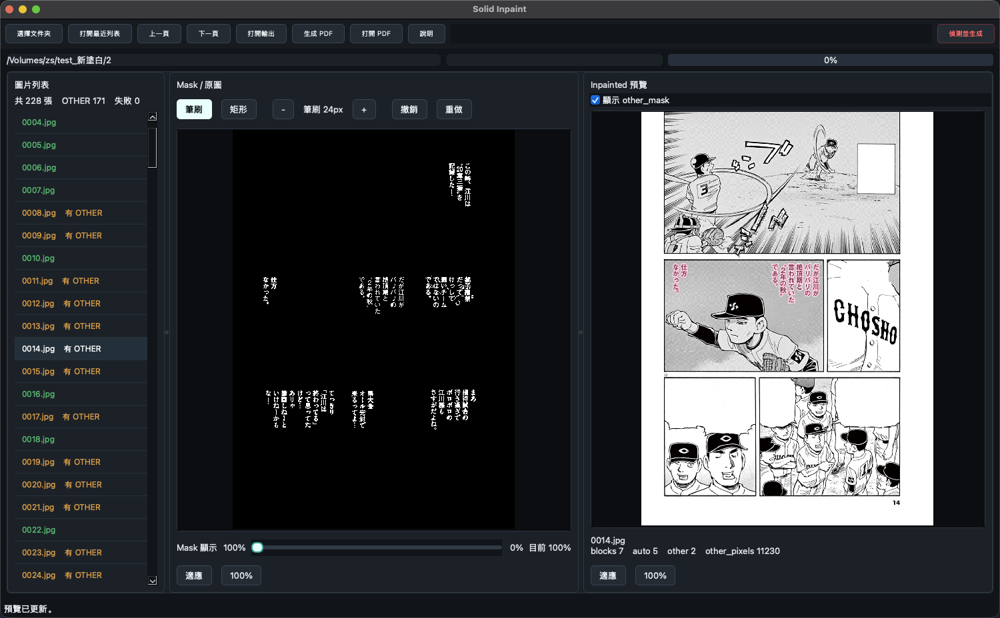

# Solid Inpaint

日文漫畫批量去字 PSD 生成工具。

網站：[https://zsisme.github.io/comic-text-detector-inpaint/](https://zsisme.github.io/comic-text-detector-inpaint/)

Solid Inpaint 會先偵測漫畫圖片中的文字，對純色背景文字生成透明去字 overlay；對非純色背景、框外字、網點、線稿或複雜背景文字，保存為 `OTHER_CHANNEL`，方便在 Photoshop 中用動作批量執行「生成式移去」。



本項目從源碼運行，支援 macOS 和 Windows，暫不打包原生 App。

## 主要用途

```text
1. 批量偵測漫畫文字 mask
2. 自動處理可靠純色背景文字
3. 生成可疊加的透明去字 overlay
4. 標記非純色背景文字為 other_mask
5. 用項目內 Photoshop JSX 生成 PSD
6. 在 PSD 中保存 TEXT_CHANNEL 和 OTHER_CHANNEL
7. 可綁定 Photoshop 動作，對 OTHER_CHANNEL 批量執行生成式移去
```

一句話：

```text
不止是生成框外去字圖，而是轉換為可繼續精修的 Photoshop PSD。
```

## 快速開始

建議使用 Python 3.10-3.12。Python 3.13+ 可能可用，但不建議普通用戶首次安裝時使用。

macOS：

```text
雙擊 launch.command
```

如果 macOS 提示命令文件不可執行，先執行一次：

```bash
chmod +x launch.command
```

Windows：

```text
雙擊 launch.bat
```

首次啟動會自動：

```text
1. 建立 .venv
2. 安裝 requirements.txt
3. 下載 models/comictextdetector.pt
4. 啟動圖形界面
```

本工具默認使用 CPU，不提供 CUDA/GPU 選項。

## 手動啟動

macOS：

```bash
python3 bootstrap.py
```

Windows：

```bat
py -3 bootstrap.py
```

如果想手動管理依賴：

macOS：

```bash
python3 -m venv .venv
.venv/bin/python -m pip install -U pip
.venv/bin/python -m pip install -r requirements.txt
.venv/bin/python solid_inpaint_ui.py
```

Windows：

```bat
py -3 -m venv .venv
.venv\Scripts\python -m pip install -U pip
.venv\Scripts\python -m pip install -r requirements.txt
.venv\Scripts\python solid_inpaint_ui.py
```

`requirements.txt` 使用 `PySide6-Essentials`，避免安裝完整 `PySide6` 時下載大型 Qt Addons。

## 圖形界面功能

```text
選擇圖片資料夾
打開最近列表
偵測並生成
不修改 mask 重生成
使用ysgyolo更新mask圖
顯示進度
瀏覽圖片列表
Mask / 原圖疊加預覽
手動編輯 mask
矩形工具：左鍵添加 mask，右鍵去掉 mask
筆刷工具：左鍵添加 mask，右鍵去掉 mask
撤銷 / 重做
編輯後自動保存 mask
自動重新生成當前頁預覽
Inpainted 合成預覽
可顯示 other_mask
打開輸出資料夾
生成 PDF 預覽
打開 PDF 預覽
```

紅色的「偵測並生成」會重新跑 detector，並覆蓋已有的 `mask`、`other_mask` 和 `inpainted` 輸出。如果輸出資料夾內已有 mask，UI 會要求確認。

「不修改 mask 重生成」不會重新跑 detector，也不會覆蓋 `mask`。它會讀取現有的 `ctd_inpainted/mask/<name>.png`，批量重新生成 `other_mask`、`inpainted` 和 `solid_inpaint_report.json`。適合在外部替換或批量修正 mask 後使用。

「使用ysgyolo更新mask圖」會讓你選擇 ysgyolo mask 文件夾。若裡面存在同名 PNG，會用 `現有 mask ∩ ysgyolo mask` 覆蓋現有 mask，然後重新生成 `other_mask`、`inpainted` 和 `solid_inpaint_report.json`；缺少同名 PNG 的頁面會保留原 mask。

快捷鍵：

```text
B：筆刷
R：矩形
[：縮小筆刷
]：放大筆刷
← / PageUp：上一頁
→ / PageDown：下一頁
Ctrl+Z：撤銷
Ctrl+Shift+Z：重做
```

## 命令行批量處理

macOS：

```bash
.venv/bin/python detect_solid_inpaint_folder.py /path/to/image_folder
```

Windows：

```bat
.venv\Scripts\python detect_solid_inpaint_folder.py D:\path\to\image_folder
```

命令行模式會處理整個圖片資料夾，並生成 PDF 預覽報告。

## 輸出結構

輸入資料夾：

```text
/path/to/image_folder
```

輸出資料夾：

```text
/path/to/image_folder/ctd_inpainted
```

主要輸出：

```text
ctd_inpainted/mask/<name>.png
ctd_inpainted/other_mask/<name>.png
ctd_inpainted/inpainted/<name>.png
ctd_inpainted/solid_inpaint_report.json
ctd_inpainted/preview_report.pdf
```

說明：

```text
mask
  偵測後的文字 mask。

inpainted
  與原圖同尺寸的透明 BGRA overlay。
  只包含自動判斷為可純色覆蓋的區域。

other_mask
  非純色背景、框外字、取樣不足或不適合自動覆蓋的區域。
  這些區域可在 Photoshop 中進一步生成式消除。

solid_inpaint_report.json
  每頁統計和 debug 資訊。

preview_report.pdf
  檢查用 PDF。每頁包含 original / preview / mask / other_mask。
```

## Photoshop PSD 配套

Python 輸出完成後，可在 Photoshop 中執行：

```text
create_psds_from_outputs.jsx
```

Photoshop 路徑：

```text
File > Scripts > Browse...
```

腳本會讀取：

```text
<image folder>/ctd_inpainted/mask/<name>.png
<image folder>/ctd_inpainted/other_mask/<name>.png
<image folder>/ctd_inpainted/inpainted/<name>.png
```

並生成：

```text
<image folder>/ctd_inpainted/psd/<name>.psd
```

每個 PSD 包含：

```text
圖層：
bg
overlay-manual

通道：
TEXT_CHANNEL
OTHER_CHANNEL
```

`overlay-manual` 是已自動去字的透明覆蓋圖層。

`OTHER_CHANNEL` 保存識別到的非純色背景文字，可用 Photoshop 動作轉成選區並批量執行「生成式移去」。

腳本窗口中可選：

```text
有 OTHER_CHANNEL 時執行動作
```

勾選後，選擇已錄好的 Photoshop 動作組和動作。腳本會在有 `OTHER_CHANNEL` 的 PSD 上自動執行該動作。

## 模型文件

模型不包含在 git 倉庫中。首次啟動時 `bootstrap.py` 會下載：

```text
models/comictextdetector.pt
```

模型來源：

```text
https://github.com/zyddnys/manga-image-translator/releases/download/beta-0.2.1/comictextdetector.pt
```

模型授權與歸屬屬於原項目。

如果缺少模型，命令行和圖形界面都會提示找不到模型文件。

## GitHub Pages

本倉庫的介紹頁放在：

```text
docs/index.html
```

啟用 GitHub Pages：

```text
1. 打開 GitHub 倉庫頁面
2. 進入 Settings
3. 左側選 Pages
4. Source 選 Deploy from a branch
5. Branch 選 main
6. Folder 選 /docs
7. Save
```

啟用後網址通常是：

```text
https://zsisme.github.io/comic-text-detector-inpaint/
```

如果 GitHub 顯示的 Pages 地址不同，以 GitHub Settings > Pages 中顯示的地址為準。

## 倉庫內容

需要保留在倉庫中的主要文件：

```text
README.md
requirements.txt
bootstrap.py
launch.command
launch.bat
detect_solid_inpaint_folder.py
solid_inpaint_ui.py
create_psds_from_outputs.jsx
models/.gitkeep
docs/
icons/
vendor/
```

不要提交：

```text
.venv/
__pycache__/
.DS_Store
ctd_inpainted/
models/comictextdetector.pt
```

## 開發注意

- `vendor/` 是 detector 程式的拷貝版本，不會自動跟外部程式同步。
- 建議用 Python 3.10-3.12 測試發佈流程。
- `requirements.txt` 鎖定 `numpy<2`，避免舊 detector 程式遇到 NumPy 2.x 移除舊別名的兼容問題。
- `inpainted` 是完整畫布尺寸的透明 PNG，不需要 Photoshop 圖層用的四角 anchor pixel。
- `other_mask` 表示不能自動純色填補、需要後續處理的 repair area。
- 每次調整純色判斷參數後，建議手動生成並查看 `preview_report.pdf`。
